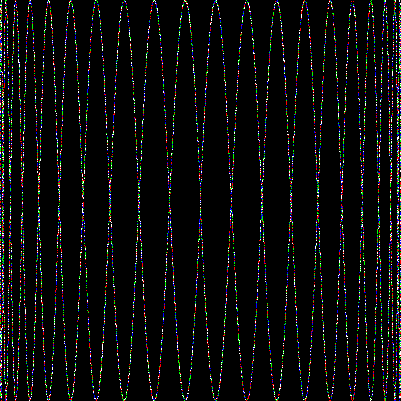

# go-studies
Notes and practice code

## Table of Contents

[[TOC]]

## ["The Go Programming Language"](http://www.gopl.io/)

### Chapter 1

A series of simple tools, such as web clients and web servers.
The gif bellow was generated and served using the program [./go-programming-language/ch1/lissajous.go](./go-programming-language/ch1/lissajous.go)

### Chapter 2
